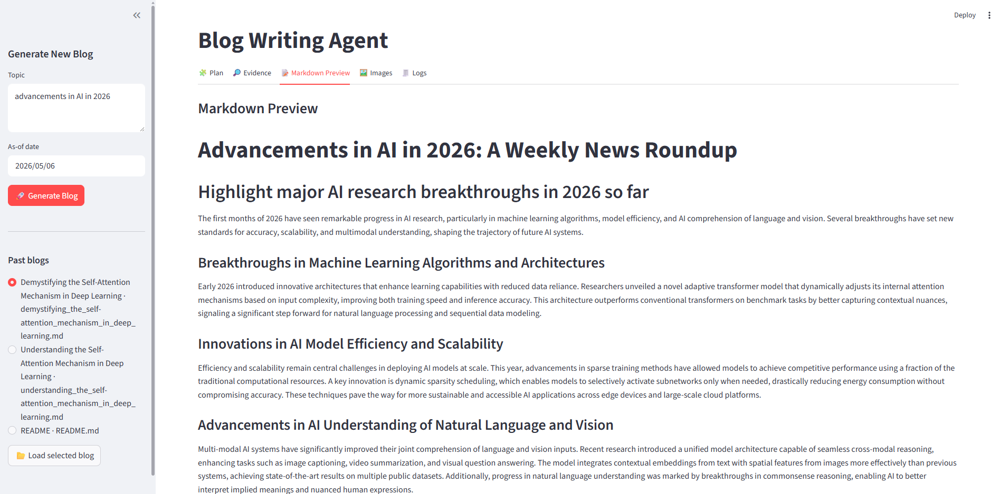

# AI Editorial Agent
An autonomous technical writing pipeline that researches, outlines, writes, and illustrates high-quality blog posts using LangGraph, OpenAI, and Gemini.

## 🚀 Overview
This project automates the entire editorial process for technical content. By providing a single topic, the agent determines the necessary research depth, scrapes the web for facts, coordinates multiple "worker" writers for different sections, and generates custom diagrams to match the text.

## 🛠️ Key Features
- **Intelligent Routing:** Automatically switches between "Open Book" (news/updates) and "Closed Book" (evergreen concepts) modes.

- **Deep Research:** Integrates with Tavily Search to fetch and cite real-world sources.

- **Parallel Writing:** Uses a "Map-Reduce" pattern to write multiple blog sections simultaneously.

- **Visual Illustrations:** Leverages Gemini to generate context-aware images and technical diagrams.

- **Interactive UI:** A Streamlit-based dashboard to monitor the agent's "thought process" in real-time.

- **Persistence:** Capabilities to load and preview past blogs stored as local Markdown files.

## 📂 File Structure
- `editorial_agent_backend.py`: The core logic. Defines the LangGraph state machine, LLM prompts, and image generation tools.

- `editorial_agent_frontend.py`: The Streamlit web application for interacting with the agent, rendering previews, and handling file downloads.

## ⚙️ Setup
Environment Variables: Create a `.env` file with the following:

```env
   OPENAI_API_KEY=your_openai_key
   TAVILY_API_KEY=your_tavily_key
   GOOGLE_API_KEY=your_google_gemini_key
   ```

Install Dependencies:

```Bash
 pip install langgraph langchain_openai langchain_core streamlit pandas google-genai python-dotenv 
 ```

Run the App:

```Bash
streamlit run editorial_agent_frontend.py
 ```
 
## 📝 How to Use
- **Input Topic:** Enter a topic (e.g., "The future of Rust in WebAssembly") in the sidebar.

- **Set Recency:** Select an "As-of date" to guide the research recency.

- **Generate:** Click Generate Blog to start the LangGraph workflow.

- **Review:** Monitor progress in the Logs tab and view the finished result in the Markdown Preview.

- **Export:** Download the final blog as a raw Markdown file or a complete .zip bundle including images.

## 📖 Examples
Examples of generated blogs are available in the directory as - `.md` files.
- `advancements_in_ai_in_2026_a_weekly_news_roundup.md` 
- `advancements_in_ai_in_2026_weekly_news_roundup.md`
- `demystifying_the_self-attention_mechanism_in_deep_learning.md`
- `understanding_the_self-attention_mechanism_in_deep_learning.md`
You can view these directly in the folder or load them through the Past blogs section in the Streamlit sidebar.

## 🖥️ Front-end
The user interface is built with **Streamlit**, providing a powerful dashboard to:
* **Monitor Progress**: Watch the agent move through research, planning, and writing nodes in real-time.
* **Interactive Previews**: View fully rendered Markdown with integrated AI-generated images.
* **Manage History**: Browse and reload past blog posts directly from the sidebar.
* **Export Content**: Download your finished work as a standalone Markdown file or a complete project bundle.

*Front-end of application*
