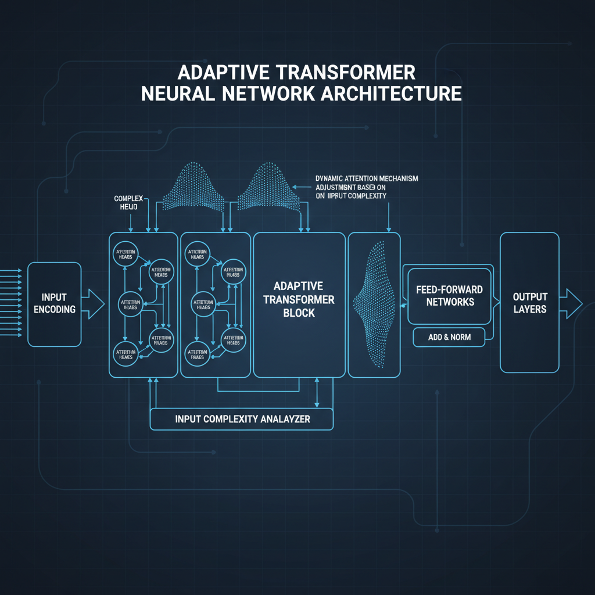
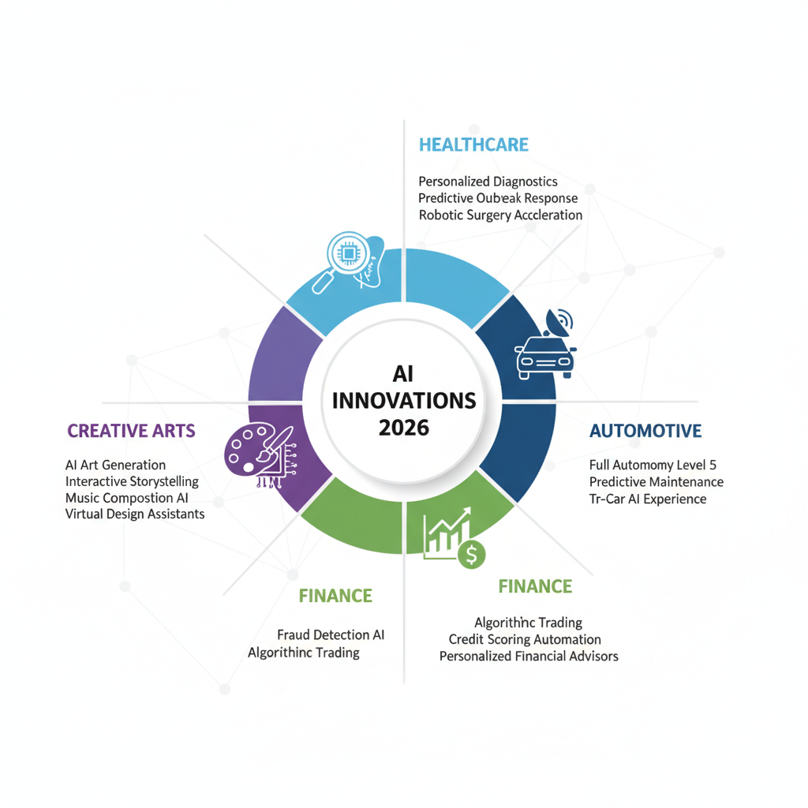
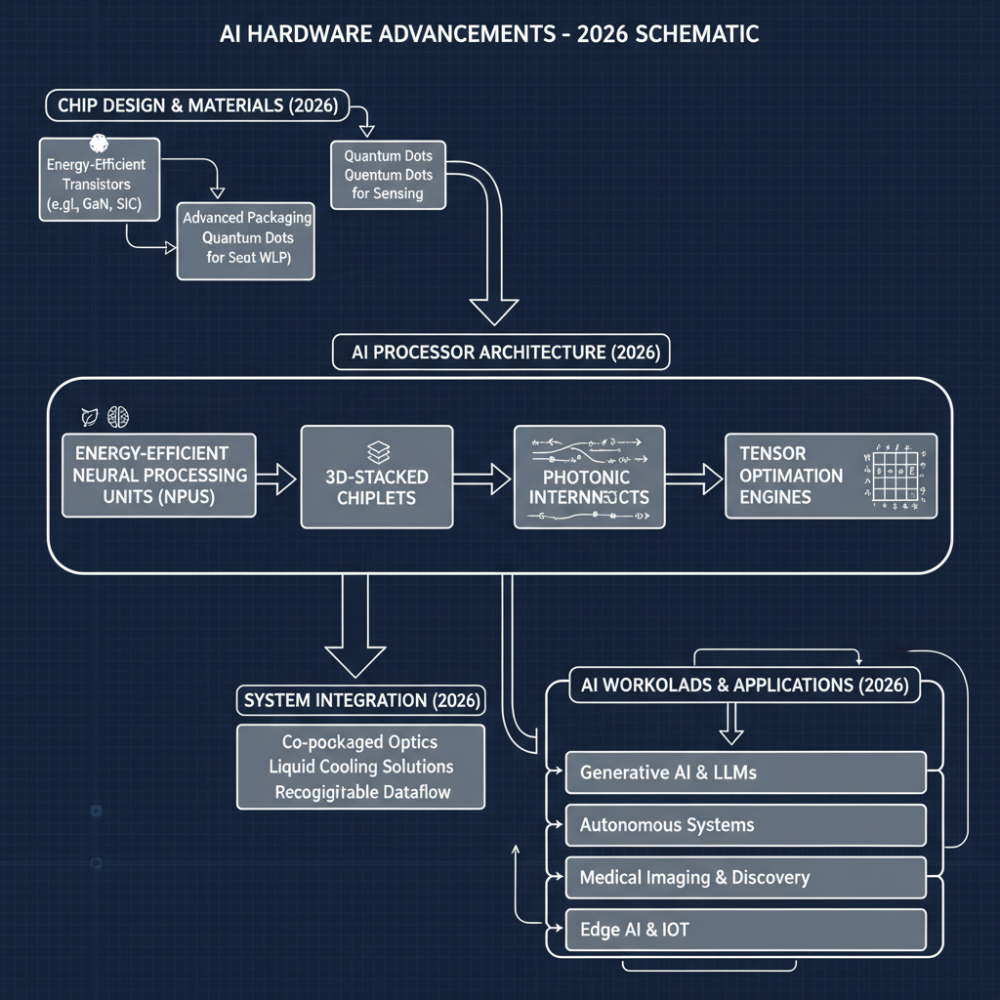

# Advancements in AI in 2026: A Weekly News Roundup

## Highlight major AI research breakthroughs in 2026 so far

The first months of 2026 have seen remarkable progress in AI research, particularly in machine learning algorithms, model efficiency, and AI comprehension of language and vision. Several breakthroughs have set new standards for accuracy, scalability, and multimodal understanding, shaping the trajectory of future AI systems.

### Breakthroughs in Machine Learning Algorithms and Architectures

Early 2026 introduced innovative architectures that enhance learning capabilities with reduced data reliance. Researchers unveiled a novel adaptive transformer model that dynamically adjusts its internal attention mechanisms based on input complexity, improving both training speed and inference accuracy. This architecture outperforms conventional transformers on benchmark tasks by better capturing contextual nuances, signaling a significant step forward for natural language processing and sequential data modeling.

### Innovations in AI Model Efficiency and Scalability

Efficiency and scalability remain central challenges in deploying AI models at scale. This year, advancements in sparse training methods have allowed models to achieve competitive performance using a fraction of the traditional computational resources. A key innovation is dynamic sparsity scheduling, which enables models to selectively activate subnetworks only when needed, drastically reducing energy consumption without compromising accuracy. These techniques pave the way for more sustainable and accessible AI applications across edge devices and large-scale cloud platforms.

### Advancements in AI Understanding of Natural Language and Vision

Multi-modal AI systems have significantly improved their joint comprehension of language and vision inputs. Recent research introduced a unified model architecture capable of seamless cross-modal reasoning, enhancing tasks such as image captioning, video summarization, and visual question answering. The model integrates contextual embeddings from text with spatial features from images more effectively than previous systems, achieving state-of-the-art results on multiple public datasets. Additionally, progress in natural language understanding was marked by breakthroughs in commonsense reasoning, enabling AI to better interpret implied meanings and nuanced human expressions.

*Adaptive transformer model dynamically adjusting attention mechanisms based on input complexity.*

Together, these developments reflect an exciting phase of AI research in 2026, laying critical groundwork for more intelligent, efficient, and versatile AI systems in the near future.

## Report on New AI Applications Launched in 2026

In 2026, AI continues to reshape various sectors through innovative applications that enhance efficiency and unlock new possibilities. Several standout developments this year highlight AI's expanding influence in healthcare, automotive, finance, and the creative industries.

### Healthcare  
AI-powered diagnostic tools have made significant strides, with companies launching advanced imaging analysis platforms capable of detecting diseases at earlier stages than traditional methods. These systems leverage deep learning to interpret complex medical scans with higher accuracy, reducing human error and expediting treatment decisions. Additionally, personalized treatment recommendation engines now integrate patient genetics and lifestyle data, enabling tailored therapies that improve outcomes.

### Automotive  
The automotive sector has seen the introduction of AI-driven driving assistance and autonomous vehicle systems with improved context awareness and decision-making. New models launched in 2026 incorporate multimodal AI sensors that fuse data from cameras, lidar, and radar, enhancing safety and navigation in challenging environments. These advancements help transition from semi-autonomous to more reliable autonomous driving experiences, potentially decreasing accidents and traffic congestion.

### Finance  
In finance, AI applications launched this year focus on fraud detection, risk assessment, and portfolio optimization. Innovative startups introduced AI platforms that analyze transaction patterns in real-time to flag fraudulent activities faster than traditional methods. Moreover, AI-driven financial advisors now provide more precise, adaptive investment strategies by continuously learning from market trends and user behavior, opening up sophisticated wealth management tools to a broader audience.

### Creative Industries  
The creative sector benefits from generative AI products launched in 2026 that assist in content creation across text, image, music, and video. These AI tools democratize creativity by automating routine tasks like editing and formatting, allowing artists and creators to focus on higher-level ideation. Some companies now offer AI collaborators capable of co-writing scripts or composing music, pushing the boundaries of human-AI partnerships in artistic expression.

### Industry Leaders  
Both startups and established tech giants are at the forefront of these innovations. Agile startups often pioneer niche applications, quickly iterating on user feedback to address specific problems, while major corporations leverage vast data resources and infrastructure to scale AI solutions globally. This synergy accelerates the deployment of AI applications that both streamline existing workflows and introduce groundbreaking functionalities.

*Overview of AI applications launched in 2026 across healthcare, automotive, finance, and creative industries.*

Overall, the AI applications debuting in 2026 demonstrate a growing maturity and diversification that promise to transform how industries operate and serve society. These advances not only optimize traditional processes but also create new paradigms for human-AI collaboration across multiple domains.

## Update on regulatory and ethical developments for AI in 2026

In early 2026, AI regulation has continued to evolve rapidly, reflecting increasing global attention on the ethical and societal impacts of AI technologies. Several key legislative actions and proposals have been introduced worldwide aiming to balance innovation with safety and accountability.

Notably, major jurisdictions have pushed forward comprehensive AI laws focused on transparency, risk management, and user rights. These laws typically mandate clearer disclosures when AI is in use and enforce stricter standards on high-risk AI applications, such as those in healthcare, finance, and public safety. Although specific national laws vary, common themes include requirements for impact assessments and auditability to ensure AI systems do not perpetuate biases or cause harm.

Ethical debates have gained momentum alongside these legal efforts, as experts and organizations propose detailed guidelines that emphasize fairness, privacy, and human oversight. Discussions increasingly explore responsible AI deployment frameworks, stressing collaboration between developers, users, and regulators. Industry bodies and research groups have shared updated ethical codes, underscoring transparency and the prevention of autonomous decision-making in critical sectors without human intervention.

On the international stage, the landscape remains complex. While some countries have strengthened partnerships to align AI governance standards, seeking harmonization to facilitate global AI development, others have adopted divergent policies reflecting distinct technological priorities and risk tolerances. This has led to both cooperative initiatives and tensions, particularly concerning AI’s role in defense and surveillance. Multilateral forums continue to serve as critical platforms for dialogue, although achieving consensus on binding global rules remains a challenge.

Overall, 2026 marks a year of significant progress in refining both regulatory frameworks and ethical norms for AI. These developments signal a growing recognition that robust governance is essential to harness AI’s benefits while mitigating its risks across societies worldwide.

## Analyze trends in AI hardware advances supporting 2026 breakthroughs

In 2026, significant innovations in AI hardware are accelerating the pace of breakthroughs across industries. New processors and AI accelerators specifically engineered for machine learning workloads have come to the forefront, delivering unprecedented compute capabilities tailored to the demands of modern AI models. These specialized chips integrate architectures optimized for tensor operations, sparse computations, and mixed-precision formats, which are essential for efficiently training and running large-scale neural networks.

One notable trend is the emphasis on energy efficiency without compromising speed. Cutting-edge hardware utilizes advanced semiconductor processes and novel materials such as 3D-stacked chips and photonic interconnects to reduce power consumption drastically. These advances enable data centers and edge devices to handle more complex AI tasks while maintaining sustainable energy profiles. This balance of speed and energy efficiency is critical as AI applications scale from cloud environments down to mobile and embedded platforms.

The impact of these hardware improvements extends beyond raw performance metricsthey are increasing the accessibility of AI research and development. More affordable and energy-efficient accelerators lower the barrier to entry for startups, academic labs, and smaller enterprises by providing high-end compute resources at reduced costs. Additionally, with hardware that supports real-time inference and training on edge devices, AI models can be deployed in diverse environments, from healthcare diagnostics to autonomous vehicles, democratizing the benefits of AI innovation.

*Key trends in AI hardware advances: energy-efficient processors, 3D-stacked chips, and photonic interconnects.*

Overall, the evolution of AI-specific hardware in 2026 plays a central role in enabling the recent wave of AI progress, driving faster experimentation, deployment, and scaling of intelligent applications across sectors.

## Summarize updates in AI safety and robustness research

Recent months in 2026 have seen significant progress in AI safety and robustness, driven by the urgent need to ensure AI systems behave reliably and transparently. Researchers have developed new methods for testing and verifying AI behaviors, focusing on rigorous evaluation techniques beyond traditional benchmarks. These include formal verification approaches that mathematically prove certain safety properties, and adversarial testing frameworks designed to identify vulnerabilities by simulating worst-case scenarios. The emphasis is increasingly on proactive detection of failure modes before deployment, which strengthens trustworthiness across critical applications.

Parallel to technical advances, there is growing momentum in collaborative safety initiatives. Notably, several leading AI research organizations and academic institutions formed a new consortium dedicated to standardizing safety protocols and sharing best practices. This group aims to unite diverse stakeholders, from engineers to policymakers, fostering transparency and coordinated responses to emerging risks. These partnerships are complemented by workshops and open challenges encouraging innovation in resilience and interpretability, helping push the field toward more robust, widely accepted safety standards.

Despite these efforts, a few reported incidents earlier this year have reinforced the complexity of AI safety. Case studies highlighted unexpected model behaviors in real-world settings, underscoring gaps between testing environments and operational deployment. Lessons learned stress the necessity of continuous monitoring and adaptive safeguards, as well as the importance of multidisciplinary approaches combining technical, ethical, and social perspectives. Such insights are shaping ongoing research agendas and reaffirm the commitment within the AI community to develop safer, more reliable systems as the technology evolves.

Together, these developments reflect a maturing landscape in AI safety research that balances technical innovation with strategic collaboration and practical lessons learned. This holistic approach is vital to advancing AI capabilities responsibly amid fast-paced progress.

## Upcoming AI Conferences and Events in the Remainder of 2026

For professionals and enthusiasts eager to stay abreast of AI advancements throughout 2026, several major conferences and workshops provide rich opportunities for learning and networking. Here are some key events to watch or attend:

- **NeurIPS 2026 (Neural Information Processing Systems)**  
  - **Dates:** December 7	6, 2026  
  - **Location:** Vancouver, Canada  
  - **Focus:** Cutting-edge research in machine learning, deep learning, and computational neuroscience.  
  - **Virtual Attendance:** Offered with live-streamed keynotes and interactive virtual sessions.  
  - **Submission Deadlines:** Paper submissions typically due in late July (exact dates to be announced).

- **ICLR 2026 (International Conference on Learning Representations)**  
  - **Dates:** May 4, 2026  
  - **Location:** Berlin, Germany  
  - **Focus:** Representation learning, unsupervised learning, and emerging AI architectures.  
  - **Virtual Options:** Hybrid attendance with recorded sessions available post-event.  
  - **Submission Deadlines:** Abstract submission closed in January; final papers due in February 2026.

- **AAAI Conference on Artificial Intelligence 2026**  
  - **Dates:** February 227, 2026  
  - **Location:** Honolulu, Hawaii, USA  
  - **Focus:** Broad AI topics including robotics, natural language processing, and social implications of AI.  
  - **Virtual Attendance:** Partial virtual participation with workshops and panels accessible online.  
  - **Submission Deadlines:** Papers usually accepted in September of the previous year.

- **CVPR 2026 (Computer Vision and Pattern Recognition Conference)**  
  - **Dates:** June 150, 2026  
  - **Location:** Tokyo, Japan  
  - **Focus:** Computer vision, image processing, and AI applications in visual data.  
  - **Virtual Attendance:** Available, including virtual poster sessions and demos.  
  - **Submission Deadlines:** Final papers due in November 2025.

- **EMNLP 2026 (Conference on Empirical Methods in Natural Language Processing)**  
  - **Dates:** November 93, 2026  
  - **Location:** Cape Town, South Africa  
  - **Focus:** Advances in natural language processing, speech recognition, and language understanding.  
  - **Virtual Participation:** Hybrid event with livestreaming and Q&A forums.  
  - **Submission Deadlines:** Papers due in April 2026.

Participating in these eventswhether in person or virtuallyprovides vital access to pioneering research, workshops, and networking opportunities with AI leaders globally. Be sure to check official conference websites periodically for updates on submission deadlines and attendance options as 2026 progresses.

_Not found in provided sources._