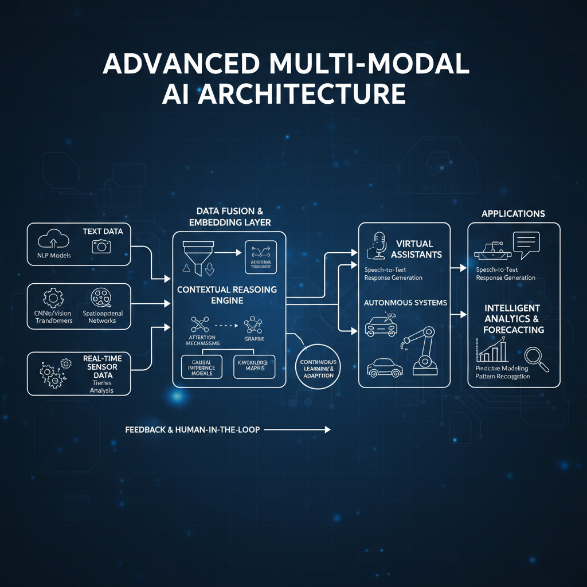
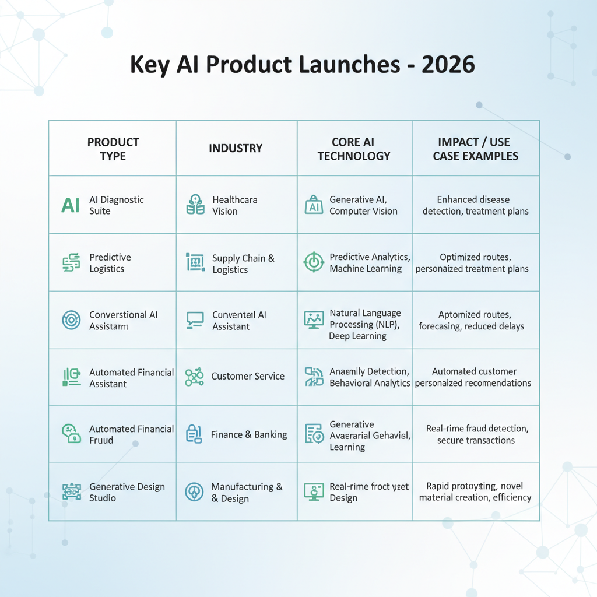
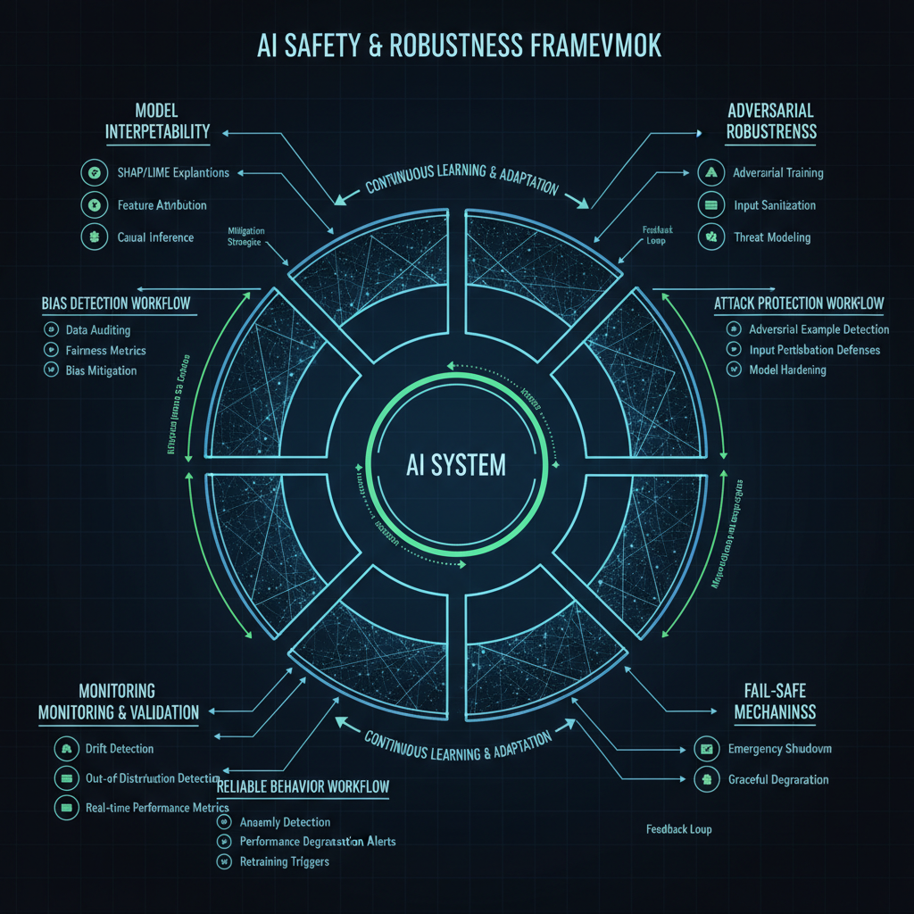

# Advancements in AI in 2026: Weekly News Roundup

## Summarize Major AI Breakthroughs Announced in Early 2026

The early months of 2026 have witnessed a series of remarkable advancements in artificial intelligence, pushing the boundaries of what AI systems can achieve and expand their applicability across industries. Several key milestones and major releases from leading AI organizations have set the tone for innovation this year, promising new opportunities and challenges for technologists and businesses alike.

One standout achievement in 2026 is the development of advanced multi-modal AI models that integrate text, images, video, and real-time sensor data seamlessly. These models have been designed to operate with significantly improved contextual understanding and reasoning, enabling more natural and sophisticated interactions. This breakthrough enables applications ranging from enhanced virtual assistants to autonomous systems capable of complex decision-making in dynamic environments.

*Multi-modal AI Model Architecture in 2026*

Leading AI research labs have also launched notable updates to flagship models with greater efficiency and adaptability. These updates emphasize optimized training techniques and model architectures that reduce computational requirements while boosting performance. Such improvements facilitate broader deployment in edge devices, promoting AI democratization outside traditional cloud environments. These efforts reflect a growing trend toward sustainable AI development focused on reducing the environmental footprint of large-scale models without sacrificing capability.

In addition to core model advancements, new AI capabilities have emerged in specialized applications. For example, AI-driven drug discovery platforms have accelerated the identification of candidate molecules by integrating vast biochemical datasets with predictive modeling. Similarly, AI systems for real-time language translation and multi-lingual communication have become more accurate and context-aware, enabling smoother global collaboration. Furthermore, progress in AI-generated creative content  including music, video, and interactive media  is reshaping entertainment and marketing sectors by providing novel tools for content generation and personalization.

Collectively, these breakthroughs highlight a pivotal phase in AI evolution where versatility, efficiency, and real-world applicability converge. As 2026 progresses, the insights and innovations introduced during the first quarter will likely influence AI research priorities and industrial adoption, reinforcing AIs transformative role across diverse domains and continuing to spark both excitement and prudent consideration regarding its societal impact.

## Analyze Trends in AI Research and Development for 2026

The landscape of AI research and development (R&D) in 2026 is marked by concentrated efforts and novel directions that reflect both technological potential and emerging societal demands. Among the most prominent research areas gaining momentum are multimodal models and explainable AI, driven by the need for richer contextual understanding and transparency in AI systems.

Multimodal AI, which integrates data from diverse sources such as text, images, audio, and sensor inputs, has become a central research focus. This approach addresses the limitations of single-modal models by enabling more holistic perception and decision-making capabilities, enhancing applications from autonomous driving to medical diagnostics. Concurrently, explainable AI (XAI) continues to garner intense research as organizations and regulators push for interpretability and accountability to mitigate risks associated with opaque "black-box" models. Efforts in XAI emphasize methods for providing clear, human-understandable justifications of AI decisions, fostering trust and ethical deployment across sectors.

Supporting these research trends are significant innovations in AI hardware and software architectures. On the hardware front, specialized AI accelerators optimized for both training and inference of complex models are increasingly prevalent. These include energy-efficient chips designed to handle the computational demands of massive multimodal models with reduced latency. On the software side, advances in distributed computing frameworks and optimized model architectures enable more scalable and flexible experimentation, shortening iteration cycles for researchers.

Financially, AI research funding in 2026 shows a notable shift towards collaborative frameworks, often involving partnerships between academia, industry, and government agencies. This trend reflects growing recognition that breakthrough innovations require pooling diverse expertise and resources across institutional boundaries. Public-private consortia and international cooperative efforts are becoming more common, emphasizing open science principles and data sharing to accelerate progress.

Overall, the R&D trends in 2026 demonstrate a maturation of AI toward systems that are not only more capable but also more transparent and responsibly developed. These evolving priorities are shaping the future trajectory of AI adoption and its societal impact, underscoring the dynamic interplay between technology innovation and governance considerations.

## Update on AI Ethics and Policy Changes in 2026

In 2026, governments and international bodies have accelerated efforts to refine AI governance policies with a clear focus on ethical deployment and regulatory oversight. Several new or revised frameworks have emerged globally, aimed at addressing critical concerns around AI fairness, transparency, and safety.

Notably, the European Union updated its AI Act to introduce stricter requirements for high-risk AI systems, emphasizing enhanced transparency mandates and rigorous safety assessments before deployment. This revised regulation mandates that developers provide detailed documentation on AI decision-making processes, enabling greater accountability and user understanding. Additionally, several Asian countries have unveiled comprehensive AI ethics guidelines that integrate principles of fairness, focusing on minimizing bias and ensuring equitable AI outcomes across diverse populations.

Parallel to policy updates, major international forums have intensified discussions on harmonizing AI ethics standards. Frameworks proposed by these collaborative efforts emphasize transparent algorithmic auditing and embedding fairness criteria throughout AI lifecycle stages, from design to deployment. These initiatives aim to create interoperable standards that prevent regulatory fragmentation and facilitate responsible AI innovation globally.

The impact of these evolving policies on AI development and deployment is already evident. Organizations are adapting by incorporating ethical review mechanisms within their AI product cycles and investing in tooling to enhance explainability and bias mitigation. Startups and established players alike are prioritizing compliance with emerging regulations to avoid legal risks and gain user trust. Consequently, the AI industry is experiencing a shift towards more transparent and socially responsible practices, which may also inspire consumer confidence and broader technology adoption.

As 2026 progresses, ongoing policy refinement and ethical discourse will remain central to shaping AI's societal benefits and risks, marking a critical phase in responsible AI governance. 

## Highlight Notable AI Product Launches and Commercial Use Cases

Since the beginning of 2026, the AI landscape has witnessed several significant product launches that underscore the technology's expanding commercial presence and versatility. Notably, advancements in generative AI, natural language understanding, and autonomous robotics have driven new offerings tailored for sectors ranging from healthcare to finance.

One of the standout launches this year includes advanced AI-driven diagnostic tools integrating multimodal data to assist clinicians with early disease detection. These systems leverage deep learning algorithms to analyze imaging, genomic, and clinical data simultaneously, improving diagnostic accuracy and personalized treatment plans. Another pivotal introduction has been enterprise-grade large language models optimized for specialized business workflows, such as contract analysis, customer service automation, and regulatory compliance monitoring. These models enhance productivity by understanding domain-specific terminology and producing contextually relevant outputs.

Real-world applications demonstrate AI's growing value and adaptability. For instance, in supply chain management, AI-powered predictive analytics platforms now enable companies to anticipate disruptions caused by geopolitical events or climate factors, allowing for proactive adjustments in sourcing and logistics. In the retail sector, personalized recommendation engines have evolved to incorporate real-time shopper behavior and sentiment analysis, elevating customer engagement and sales conversions. Additionally, the financial services industry benefits from fraud detection systems using AI to analyze complex transaction patterns with greater sensitivity and reduced false positives.

*Notable AI Product Launches and Commercial Use Cases in 2026*

Several industries are experiencing accelerated AI adoption as a result of these innovations. Healthcare continues to be a front-runner, with AI augmenting roles from diagnostics to patient management. Manufacturing sectors are increasingly deploying AI-fueled robotics and quality assurance systems to optimize production lines and reduce downtime. Meanwhile, professional services, including legal and accounting firms, are harnessing AI tools to streamline document processing and data extraction, gaining efficiency and accuracy.

Overall, the AI product launches and use cases emerging in 2026 reaffirm the technologys expanding footprint across diverse industries. These developments reflect a trend toward deeper integration of AI capabilities into critical business functions, signaling not only enhanced operational effectiveness but also the creation of new value propositions in the marketplace.

## Cover Advances in AI Safety and Robustness Techniques

Recent months have seen notable breakthroughs in AI safety and robustness, underscoring the communitys growing commitment to developing reliable and interpretable models. A key area of progress is AI model interpretability, where researchers have introduced advanced methods that provide clearer insights into decision-making processes. These techniques help demystify complex neural networks, making it easier to detect and mitigate biases or errors before deployment. Enhanced interpretability serves as a fundamental pillar in building trust and ensuring accountability in AI systems.

Alongside interpretability, robustness has seen significant improvements through innovative approaches that protect models against adversarial attacks and distribution shifts. New training methods and architecture designs improve resistance to unexpected inputs, ensuring AI performance remains stable in diverse real-world scenarios. These robustness enhancements are crucial for deploying systems in safety-critical applications, such as autonomous vehicles or healthcare diagnostics.

*Advances in AI Safety and Robustness Techniques in 2026*

On the safeguards front, there is an increased emphasis on frameworks that prevent AI misuse or unintended consequences. Research initiatives have prioritized the development of monitoring tools and fail-safe mechanisms that can halt AI systems exhibiting harmful or unforeseen behavior. This proactive stance seeks to align AI behavior more closely with human values and regulatory requirements, reducing risks associated with autonomous decision-making.

Looking at broader trends, safety-focused AI research projects are increasingly interdisciplinary, combining insights from computer science, ethics, and policy. Funding bodies are supporting collaborations that aim to establish comprehensive standards for AI safety and governance. Furthermore, open-source platforms for safety evaluation foster community-driven improvements, accelerating the adoption of best practices industry-wide.

Overall, these advances mark a positive trajectory toward making AI systems safer and more reliable, reflecting a maturing field that recognizes robustness and interpretability as essential to AI's sustainable integration into society.  

## Discuss Emerging AI Hardware Innovations in 2026

In 2026, the AI hardware landscape is witnessing significant advancements that promise to reshape model training and deployment efficiency. Several new AI accelerators and specialized chips have been announced recently by leading semiconductor firms and startups. These innovations primarily focus on heterogeneous computing architectures, combining traditional CPUs with dedicated AI cores optimized for parallel processing and sparse data handling. Novel chip designs emphasize on-chip memory hierarchies and interconnect technologies to reduce data movement latency, a major bottleneck in AI workloads.

The impact of these hardware improvements on AI performance is substantial. Enhanced throughput and lower latency enable more complex models to be trained faster and at a lower cost. Inference tasks benefit from reduced power consumption and increased responsiveness, making real-time AI applications more viable across industries such as autonomous vehicles, healthcare diagnostics, and edge devices. Furthermore, hardware tailored to support large language models and multi-modal architectures is accelerating research cycles and enabling more sophisticated AI capabilities.

A key trend in 2026 is the drive toward energy-efficient AI systems. Innovations such as analog AI computing, neuromorphic chips, and specialized low-precision computing units are gaining traction, aiming to deliver high performance with significantly reduced energy footprints. Scalability remains a priority, with modular AI hardware designs facilitating expansion from edge devices to data center-scale deployments seamlessly. This combination of energy efficiency and scalability is critical for sustainable AI growth and aligns with global efforts to reduce carbon emissions linked to large-scale AI computations.

Together, these hardware advances underline a shift toward smarter, more adaptable AI infrastructure capable of supporting the next generation of intelligent applications more sustainably and efficiently. As this trend continues, we can expect the boundaries of AI innovation to expand, driven by the synergy between cutting-edge hardware and evolving AI algorithms. 

## Outline Challenges and Criticisms Faced by AI in Early 2026

The early months of 2026 have revealed a complex landscape of challenges and criticisms that continue to shape AI developments. Among the foremost concerns are ethical dilemmas, societal impacts, and technical limitations that have sparked widespread debate within the industry and beyond.

Ethically, AI applications have faced scrutiny over biases lingering in training data and decision-making processes, leading to questions about fairness and accountability. Several high-profile cases exposed how AI systems inadvertently reinforced existing social inequalities, prompting calls for more transparent and inclusive model design practices. Additionally, debates intensified around the governance of AI in sensitive sectors like healthcare and criminal justice, where erroneous outputs could have severe consequences. This highlights the ongoing struggle to balance innovation with responsible deployment.

Technically, the field encountered notable setbacks this year. Some ambitious AI projects aimed at autonomous systems and large-scale language models experienced delays or partial failures. These issues were often linked to overestimated capabilities or underappreciated complexity in real-world environments, emphasizing the gap between laboratory benchmarks and practical robustness. Such challenges serve as a reminder that AI is still evolving and that caution remains necessary when scaling solutions.

Public perception has been equally volatile. Media coverage in early 2026 tends to reflect a mix of excitement and apprehension, with headlines ranging from breakthroughs in AI-assisted medicine to concerns about job displacement and surveillance. The narrative frequently oscillates between optimism about AIs potential to improve lives and worry about unintended harms or loss of human control. This duality underscores the importance for developers and policymakers to engage in transparent communication and foster trust.

Overall, the developments in early 2026 reflect a growing maturity in understanding AIs strengths and limits. While enthusiasm for AIs possibilities runs high, ongoing critiques and real-world challenges emphasize the need for careful, ethical progress to ensure these technologies benefit society as a whole.
