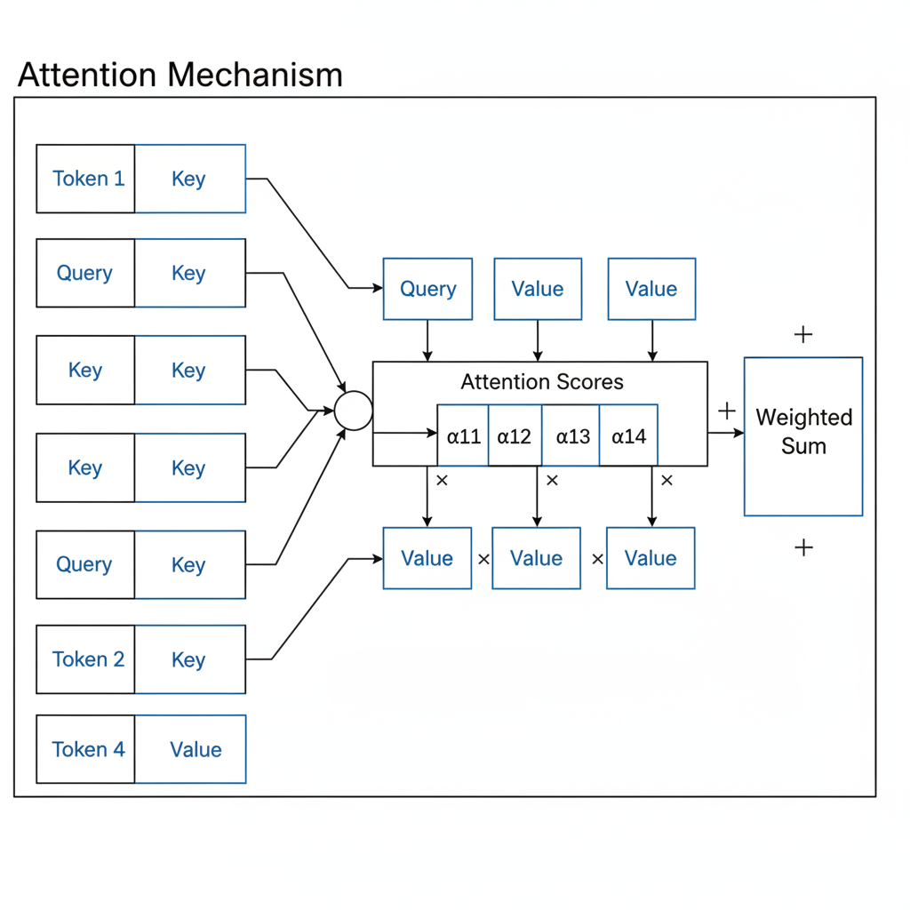
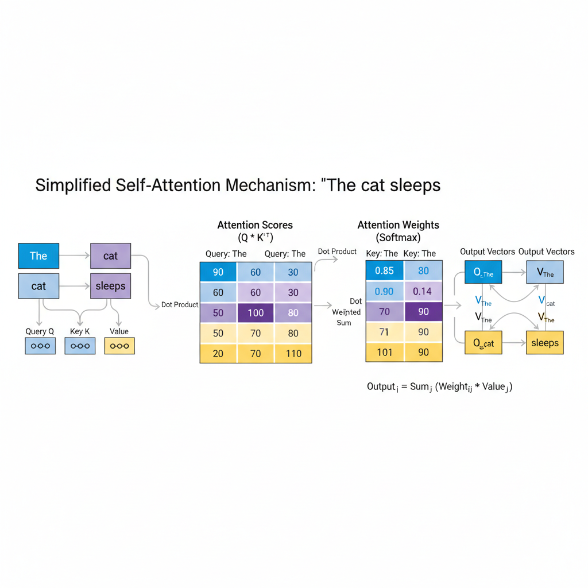
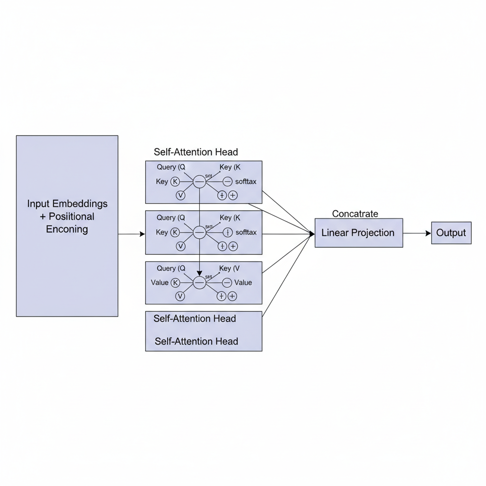

# Demystifying the Self-Attention Mechanism in Deep Learning

## Introduction to Attention Mechanisms

Attention mechanisms have become a fundamental concept in modern neural networks, especially in natural language processing and computer vision. At its core, **attention** is a way for a model to dynamically focus on different parts of the input when making decisions, rather than treating all input elements equally. This selective focus allows the model to weigh the importance of various input components depending on the current task or context.

Traditionally, models like recurrent neural networks (RNNs) or convolutional neural networks (CNNs) processed data either sequentially or through fixed-size windows. While effective, these approaches often struggled with long-range dependenciescapturing relationships between distant elements in a sequenceor variable-sized inputs. Attention mechanisms address this limitation by enabling the model to look directly at all parts of the input simultaneously and decide which parts are most relevant. This adaptability improves the model 9s ability to understand complex patterns and context, leading to better performance on tasks such as translation, summarization, and image recognition.

There are several variants of attention mechanisms, primarily distinguished by how they calculate the importance scores between elements. Two common types are:

- **Additive Attention:** Sometimes called Bahdanau attention, this approach uses a small neural network to learn a compatibility function that combines query and key vectors, producing a score that reflects relevance.

- **Multiplicative Attention:** Also known as dot-product or scaled dot-product attention, this technique computes the score as the dot product between query and key vectors, often followed by a scaling factor to maintain numerical stability.

Understanding these foundational ideas around attention sets the stage for exploring the more advanced self-attention mechanisms that power cutting-edge models, enabling them to handle sequences with greater flexibility and context awareness.

## What is Self-Attention?

Self-attention is a specialized form of the attention mechanism applied *within* a single sequence, allowing a model to weigh the importance of different elements of that sequence relative to each other. Unlike general attention, which often computes relevance between two separate sequences (e.g., encoder-decoder attention in sequence-to-sequence models), self-attention focuses inward, helping the system understand relationships among tokens in the same input.

At its core, self-attention relies on the **key, query, and value** framework. Each token in the sequence is transformed into three vectors:
- **Query (Q)**: Represents the token looking for relevant information.
- **Key (K)**: Represents each token9s identifying information.
- **Value (V)**: Contains the actual information to be aggregated.

The mechanism computes a compatibility score between the query of one token and the keys of all tokens, determining how much attention to allocate. This score is then normalized (usually via softmax) to serve as weights for summing the values. Essentially, each token gathers information from all others, weighted by their relevance.

One way to visualize this is to imagine reading a sentence and, at each word, mentally highlighting which other words are important to understanding the context. Self-attention formalizes this mental process mathematically and enables models to dynamically weigh these influences.

The benefits of self-attention are substantial. First, it **captures long-range dependencies** effectivelytokens far apart in the sequence can interact directly without the information bottlenecks of traditional recurrent models. Second, self-attention is **highly parallelizable**, as all token interactions can be computed simultaneously, leveraging modern hardware efficiently. This parallelism contrasts with sequential processing in recurrent networks, leading to faster training and inference times.

In summary, self-attention transforms a single sequence into a rich context-aware representation by letting each token attend to every other token, bridging distant parts of the sequence and enabling powerful, scalable models like transformers.

*Overview of query, key, and value vectors and their interactions in self-attention.*

## Mathematical Formalization of Self-Attention

To truly understand self-attention, it's helpful to look at the core mathematical concepts that power itspecifically, the roles of queries, keys, and values, and how they interact to produce the attention output.

### Query, Key, and Value Vectors

In the self-attention mechanism, each input element (such as a word embedding in a sentence) is projected into three different vectors:

- **Query (Q)**: Represents the vector we use to "ask" what to attend to.
- **Key (K)**: Encodes the identity or features used to match queries.
- **Value (V)**: Contains the actual information to be aggregated based on attention.

Mathematically, if we consider an input sequence represented by a matrix \( X \in \mathbb{R}^{n \times d} \), where \( n \) is the sequence length and \( d \) is the embedding dimension, then the queries, keys, and values are computed as:

\[
Q = XW^Q, \quad K = XW^K, \quad V = XW^V
\]

Here, \( W^Q, W^K, W^V \in \mathbb{R}^{d \times d_k} \) are learnable weight matrices that transform the inputs into query, key, and value spaces, respectively. The dimension \( d_k \) can be chosen independently of \( d \).

### Computing Attention Scores with Scaled Dot-Product

Once we have our queries and keys, we compute the raw attention scores by taking the dot product between each query and all keys:

\[
\text{scores} = Q K^\top
\]

This produces a matrix of size \( n \times n \), where each element \( s_{ij} \) shows how compatible the \(i\)-th query is with the \(j\)-th key. To prevent the dot products from growing too large (which can cause gradients to vanish or explode), these scores are scaled by the square root of the key dimension:

\[
\text{scaled scores} = \frac{Q K^\top}{\sqrt{d_k}}
\]

### Softmax Normalization and Weighted Sum

These scaled scores still need to be converted into a probability distribution across all keys for each query. This is where the **softmax function** comes in, turning the scores into attention weights that sum to 1:

\[
\alpha_{ij} = \frac{\exp\left(\frac{q_i \cdot k_j}{\sqrt{d_k}}\right)}{\sum_{m=1}^n \exp\left(\frac{q_i \cdot k_m}{\sqrt{d_k}}\right)}
\]

Here, \( \alpha_{ij} \) represents how much attention the \(i\)-th query pays to the \(j\)-th key.

Finally, these attention weights are used to compute a weighted sum over the value vectors, producing the output representation for each position:

\[
\text{output}_i = \sum_{j=1}^n \alpha_{ij} v_j
\]

Stacking this for all \( n \) queries yields the self-attention output matrix:

\[
\text{Output} = \text{softmax}\left(\frac{Q K^\top}{\sqrt{d_k}}\right) V
\]

---

To summarize with an analogy: Think of the query as a question, the keys as potential answers' labels, and the values as the detailed answers themselves. The dot products score how well each question matches an answer label, softmax turns these scores into confidence probabilities, and the weighted sum combines the answers accordinglyresulting in a context-aware, dynamically weighted representation of the input.

This mathematical elegance allows models to flexibly capture dependencies at varying positions in the input sequence without fixed window sizes, making self-attention a cornerstone of modern deep learning architectures.

## Implementing Self-Attention: Conceptual Walkthrough

To make the abstract concept of self-attention more tangible, let's walk through a simple example. Imagine we have a short input sequence of three words: **The cat sleeps.** Our goal is to understand how self-attention processes this sequence by generating queries, keys, and values, calculating attention scores, and combining information to produce context-aware outputs.

### Step 1: Deriving Queries, Keys, and Values

In self-attention, each word (or token) in the sequence is first mapped to three vectors: a **query**, a **key**, and a **value**. These vectors are typically created by multiplying the word's embedding by learned weight matrices. For simplicity, suppose embeddings and weight matrices are small enough to manually track.

- The e_1
- cat e_2
- sleeps e_3

We then transform each embedding:

- Query: \( q_i = W_Q \times e_i \)
- Key: \( k_i = W_K \times e_i \)
- Value: \( v_i = W_V \times e_i \)

where \(i\) indexes the tokens. Think of queries as questions asking *which parts of the sequence should I focus on?*, keys as descriptive labels for each token, and values as the content to be aggregated.

### Step 2: Calculating Attention Scores

Next, to determine how much attention each token pays to the others, we compute the **attention score** between queries and keys. This is often done via a dot product:

\[
\text{score}(q_i, k_j) = q_i \cdot k_j
\]

For example, the query from cat compares to the keys of The, cat, and sleeps. These scores indicate relevance; a higher score means greater attention.

Applying a softmax function converts raw scores into probabilities that sum to 1:

\[
\alpha_{ij} = \frac{\exp(\text{score}(q_i, k_j))}{\sum_{m} \exp(\text{score}(q_i, k_m))}
\]

Here, \(\alpha_{ij}\) is the attention weight from token \(i\) to token \(j\).

### Step 3: Producing the Output

The final output vector for each token is a weighted sum of all value vectors, where weights correspond to the attention probabilities:

\[
\text{output}_i = \sum_j \alpha_{ij} v_j
\]

This operation effectively mixes information from the whole sequence, allowing each token to incorporate context dynamically.

### Intuition Behind Learned Attention Weights

Why does this help? Consider our example The cat sleeps. When processing cat, the model might assign a higher attention weight to sleeps, recognizing that cat and sleeps relate closely (subject and verb). For The, attention might spread more evenly, as its a function word providing limited semantic content.

Over many iterations, the model learns to tune the weight matrices \(W_Q\), \(W_K\), and \(W_V\) so that attention scores emphasize meaningful relationshipssyntactic or semanticbetween tokens. This allows downstream tasks to leverage rich, context-aware representations rather than isolated word embeddings.

In sum, self-attention transforms sequences by dynamically weighing all tokens against each other, capturing dependencies regardless of their positions. This flexibility is a core reason why attention-based architectures excel in natural language processing and beyond.

*Conceptual walkthrough of self-attention on the sentence: 'The cat sleeps'. Shows queries, keys, values, attention score computation, softmax weights, and output vector generation.*

## The Role of Self-Attention in Transformers

At the heart of Transformer models lies the self-attention mechanism, a powerful method that enables the model to weigh the importance of different parts of the input sequence relative to each other. Rather than processing tokens independently or sequentially, self-attention allows the model to dynamically focus on relevant tokens across the entire sequence when generating each element of the output.

One key innovation in Transformers is the use of **multiple self-attention heads**. Instead of a single attention layer, these heads run in parallel, each learning to capture different types of relationships or features between tokens. For example, one head might focus on syntactic structure while another captures semantic context. This multi-headed approach enriches the model9s understanding, allowing it to represent complex dependencies more effectively than a single attention mechanism could alone.

However, because self-attention treats input tokens as a set rather than a sequence, the model needs a way to understand the order of tokens. This is where **positional encoding** comes into play. Positional encodings inject information about the position of each token within the sequence into the model, often using sinusoidal functions or learned embeddings. These encodings complement self-attention by enabling the Transformer to distinguish the sequence order, ensuring it understands not just which tokens to attend to, but also their relative positionsa critical factor for language understanding.

The ability of self-attention combined with positional encodings makes Transformers especially suited for sequential tasks like **language modeling and machine translation**. For example, in language modeling, the model predicts the next word based on the entire preceding context, dynamically attending to relevant preceding words. In machine translation, self-attention helps the model align words across languages, capturing intricate correspondences regardless of word order differences. This architectural synergy is a major reason Transformers have revolutionized natural language processing and enabled state-of-the-art performance across numerous tasks.

## Benefits and Limitations of Self-Attention

Self-attention has revolutionized how deep learning models understand sequences by enabling them to capture global context. Unlike traditional sequential models like RNNs, which process inputs token by token, self-attention considers relationships between all tokens simultaneously. This comprehensive view allows models to weigh the importance of each word or element in relation to others, making it excellent for tasks like language translation, text summarization, and beyond. Additionally, because self-attention layers can be computed in parallel across the entire sequence, training times are significantly reduced compared to strictly sequential methods, enabling faster experimentation and scalability.

However, these advantages come with notable challenges. The core of self-attention relies on computing pairwise interactions between all tokens in a sequence, resulting in a quadratic growth in computational cost and memory usage as sequence length increases. In practice, this means handling very long sequences such as lengthy documents or high-resolution images can quickly become resource-prohibitive. Managing this complexity requires careful engineering and often limits model deployment on memory-constrained devices.

Fortunately, the research community actively addresses these limitations. Innovations like sparse attention mechanisms and low-rank approximations aim to reduce both computational load and memory footprint without sacrificing performance. For example, some approaches restrict the attention scope to local neighborhoods or use clustering to approximate global interactions more efficiently. These advances continue to push the boundaries of whats feasible, making self-attention not only powerful but increasingly practical across diverse applications.

In summary, self-attention strikes a balance between modeling rich global dependencies and managing resource demands. Understanding its benefits and trade-offs equips practitioners to apply it effectively and stay informed about emerging improvements.

## Conclusion and Further Learning Resources

To wrap up, the self-attention mechanism fundamentally reshapes how models understand context by allowing every element in a sequence to dynamically weigh the importance of others. This flexibility enables deep learning modelsespecially transformersto excel at capturing long-range dependencies in data, which is crucial for tasks like language understanding, translation, and beyond. Key takeaways include recognizing how self-attention moves away from fixed receptive fields, the role of query, key, and value vectors in computing attention scores, and how these scores guide the model9s focus in processing sequences.

For those eager to deepen their knowledge, foundational papers such as *Attention Is All You Need* by Vaswani et al. provide the seminal introduction to the transformer architecture and self-attention. Tutorials from platforms like the Deep Learning Specialization by Andrew Ng or the Illustrated Transformer by Jay Alammar offer intuitive explanations and visualizations that clarify the underlying concepts.

If you want to experiment hands-on, popular libraries like Hugging Face9s Transformers, PyTorch9s `torch.nn.MultiheadAttention`, and TensorFlow's `tf.keras.layers.MultiHeadAttention` provide ready-to-use implementations. These tools allow you to build, tweak, and visualize self-attention layers within larger models, making them ideal for both research and practical applications.

Exploring these resources will enhance your mastery of self-attention and empower you to apply it effectively in your projects.

*Multi-headed self-attention mechanism in Transformers showing parallel attention heads and positional encoding added to the input embeddings.*