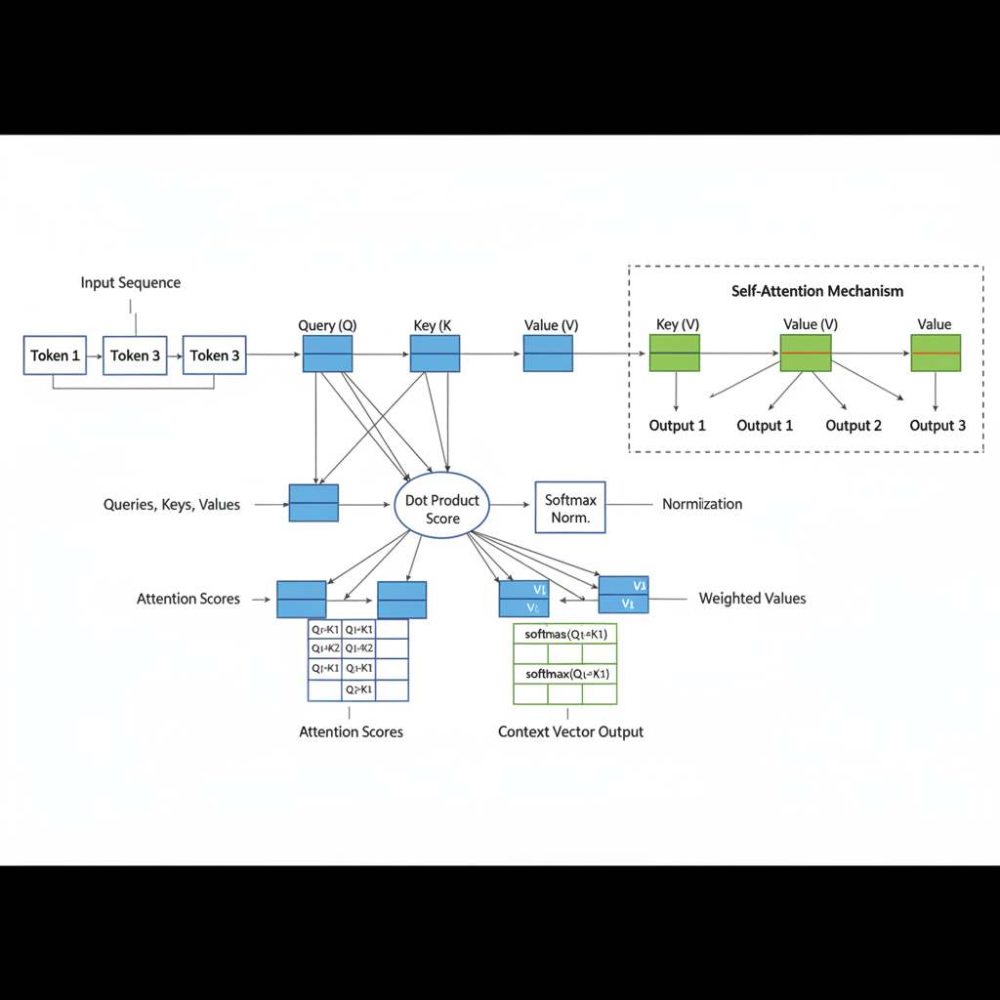
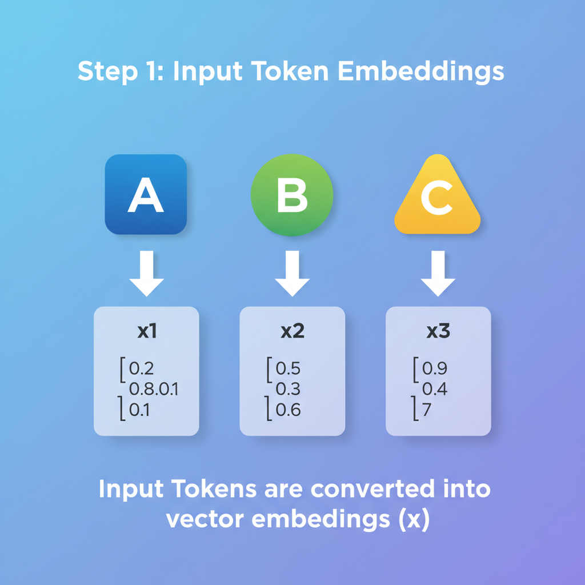
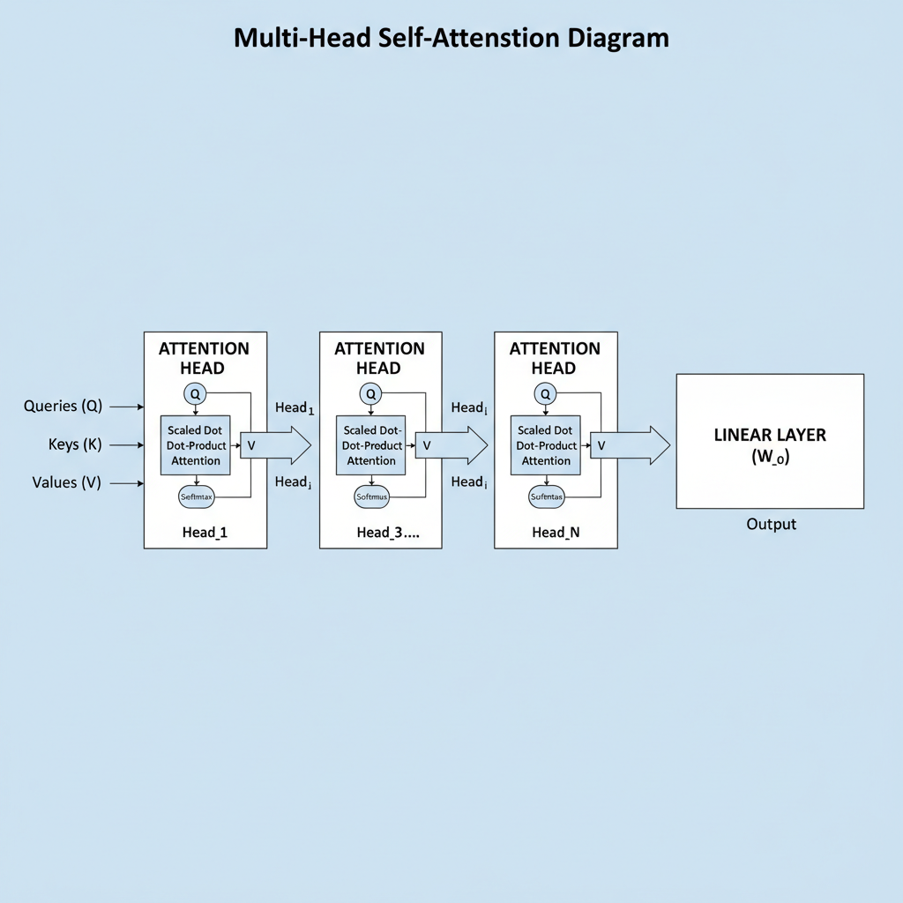

# Understanding the Self-Attention Mechanism in Deep Learning

## Introduce the Concept of Attention in Neural Networks

Attention in neural networks is a mechanism designed to help models focus on the most relevant parts of the input data when making predictions. Imagine reading a long document and trying to answer a question about it—you wouldn’t treat every word with equal importance. Instead, you naturally focus on the sentences that matter most. Attention enables neural networks to emulate this selective focus by assigning different weights to different input elements, highlighting the most informative pieces.

Traditional sequence models, such as recurrent neural networks (RNNs) or long short-term memory networks (LSTMs), process data in a linear, step-by-step manner. While effective in many cases, these models face challenges when dealing with long sequences or complex patterns: they often struggle to retain important information from earlier steps, leading to a loss of context. This “bottleneck” limits the model’s ability to capture relationships over long distances or handle highly dimensional input effectively.

Attention mechanisms address these limitations by allowing models to access all parts of the input sequence simultaneously, dynamically weighing their relevance for each output step. This approach improves both interpretability and performance, especially in tasks involving natural language processing, speech recognition, and computer vision.

There are several types of attention mechanisms used in practice—from simple additive and multiplicative attention to more complex forms such as multi-head attention. Each type offers a different approach to computing the importance scores and combining information. Notably, self-attention stands out because it lets a sequence element attend to all other elements within the same sequence, enabling rich contextual understanding without relying solely on sequential processing.

In summary, attention revolutionizes how neural networks handle complex, sequential, and high-dimensional data by providing a powerful way to focus computational resources on the most informative parts of the input. This lays the groundwork for more advanced mechanisms like self-attention, which we will explore in the next sections.

## Explain the Self-Attention Mechanism Fundamentally

Self-attention is a powerful mechanism used within a single sequence or data structure to enable a model to weigh the importance of different elements relative to each other. Unlike general attention, which often relates one sequence to another (such as in machine translation from a source to a target sentence), self-attention operates internally, examining relationships within the same sequence. This capability is especially useful in understanding context and dependencies that occur across distant parts of the input.

At the heart of self-attention are three critical components: **queries**, **keys**, and **values**. Each element in the input sequence is transformed into these three representations. Think of queries and keys as a way for the model to ask, "How much should I pay attention to this part?" and "How relevant is this other part to that question?" The values represent the content or information carried by each element that will ultimately be combined, weighted by their importance.

To quantify relevance, the model computes similarity scores between a query and all keys in the sequence, often using a dot product. This produces raw attention scores indicating how closely related each element is to the current query. Next, these scores are normalized using the softmax function, which converts them into a probability distribution. This normalization ensures that the attention weights are non-negative and sum to one, making it easier for the model to interpret them as relative importance.

Finally, self-attention calculates a weighted sum of the value vectors, where each value is multiplied by its corresponding attention weight. This aggregated vector then captures the context-aware representation for each position in the sequence, integrating information from every other relevant part.

Compared to general attention mechanisms, the key difference with self-attention lies in its focus on **internal dependencies**. It learns how elements within a sequence relate to each other without requiring external inputs, enabling the model to capture long-range dependencies and complex hierarchical structures efficiently. This internal examination helps neural networks excel in tasks like language modeling, where understanding the interplay of different words or tokens is crucial.

In summary, self-attention transforms a sequence by allowing each element to attend to all others, using queries, keys, and values to measure relevance, normalize attentions via softmax, and produce a context-rich weighted sum, all within the same data structure. This mechanism underpins many state-of-the-art models by offering a flexible and scalable way to model relationships inside sequences.

*Overview of the self-attention mechanism showing queries, keys, values, and the calculation of attention weights within a sequence*

## Break Down the Self-Attention Computation Step-by-Step

To truly grasp how self-attention works, it helps to walk through the computation with clear examples and analogies, keeping the math approachable while still precise.

### Vector Representations of Input Tokens

Imagine you have a sentence, such as *"The cat sat on the mat."* Each word in this sentence is first converted into a numeric form called a **vector**. These vectors, often called embeddings, capture semantic information about the words in a multi-dimensional space. For example, the word "cat" might be represented by a vector like `[0.2, 1.1, -0.5, 3].` This transformation allows the model to manipulate and compare words using algebraic operations.

### Calculating Query, Key, and Value Vectors

Once we have the embedding vectors for each token, self-attention computes three new vectors for each token: the **query (Q)**, the **key (K)**, and the **value (V)**. These are produced by learned linear transformationsessentially multiplying the input vector by three different matrices:

- \( Q = XW^Q \)
- \( K = XW^K \)
- \( V = XW^V \)

Here, \( X \) is the original token embedding matrix, and \( W^Q, W^K, W^V \) are parameter matrices the model learns during training. Think of queries and keys as asking "what information am I looking for?" and "what information do I have?" respectively, while values contain the actual information to be passed along.

### Finding Attention Scores via Dot Products

Next, the model measures how much focus each token should have on others. It does this by taking the **dot product** between the query vector of one token and the key vectors of all tokens. Mathematically:

\[
\text{Attention score}_{ij} = Q_i \cdot K_j^T
\]

This dot product measures similarity or relevance between tokens \( i \) and \( j \). A higher dot product means the token \( i \)'s query aligns well with token \( j \)'s key, indicating stronger attention.

### Scaling the Attention Scores

Because the dot product values can grow large in magnitude (especially with high-dimensional vectors), a **scaling factor** is applied to stabilize gradients and improve training. This is done by dividing each attention score by the square root of the key dimension \( d_k \):

\[
\text{Scaled score}_{ij} = \frac{Q_i \cdot K_j^T}{\sqrt{d_k}}
\]

This scaling prevents the softmax function (coming next) from producing extremely small gradients, which could hinder learning.

### Applying Softmax to Compute Attention Weights

The scaled scores are passed through a **softmax** function, which converts them into a probability distribution over all tokens. This ensures that the attention weights across all tokens sum to 1 for each query token:

\[
\alpha_{ij} = \text{softmax}(\text{Scaled score}_{ij}) = \frac{\exp(\text{Scaled score}_{ij})}{\sum_k \exp(\text{Scaled score}_{ik})}
\]

Here, \( \alpha_{ij} \) represents how much attention token \( i \) pays to token \( j \).

### Producing Output Vectors via Weighted Sums

Finally, the model computes the output vector for each token by taking a weighted sum of the **value vectors** using these attention weights:

\[
\text{Output}_i = \sum_j \alpha_{ij} V_j
\]

This means each token's output is a blend of information from other tokens, weighted by their relevance. In effect, self-attention allows the model to dynamically gather context from the entire sequence for each position.

---

### Visual Analogy

Picture a roundtable discussion where each person (token) asks questions (queries) and listens for answers (keys) from others, deciding how much to weigh each response. The final insights they share (output) are formed by combining these attentive listens, enabling rich, context-aware understanding.

By breaking down these steps, self-attention reveals itself as a powerful yet elegant mechanism that enables deep learning models to capture complex relationships in data.

*Step-by-step flow of self-attention computation from input token vectors to output vectors via queries, keys, values, dot product, scaling, softmax, and weighted sum*

## Discuss the Role of Multi-Head Self-Attention

Multi-head attention is an extension of the self-attention mechanism where multiple self-attention operationscalled "heads"are performed in parallel. Instead of computing one single attention distribution, the model splits the input features into multiple subspaces and runs attention independently on each. This process enables the model to capture diverse types of relationships within the input sequence at the same time.

One key benefit of multi-head attention is its ability to focus on different aspects or features of the input simultaneously. For example, in a sentence, one attention head might learn to capture syntactic dependencies (like subject-verb agreement), while another might focus on semantic aspects (like coreference or topic relevance). This parallelism enriches the representational power of the model, allowing it to understand context in a more nuanced way than a single attention mechanism could.

After each head performs its self-attention computations, their outputsvectors of equal dimensionare concatenated into one larger vector. This concatenated output is then passed through a linear projection layer, which combines the information from all heads into a final unified representation for the next layer in the network. This step helps integrate the various perspectives captured by different heads and prepares the data in a dense, expressive format for downstream processing.

Overall, multi-head self-attention increases model expressivity by allowing it to model complex interactions within input data, capturing multiple types of dependencies concurrently. It also enhances robustness since individual heads can specialize or compensate for others, reducing the risk of missing critical information. This design is one of the crucial reasons why transformers and their variants achieve state-of-the-art performance across many domains in deep learning.

*Diagram of multi-head self-attention illustrating parallel attention heads, independent computations, concatenation, and final linear projection*

## Explore Applications of Self-Attention in Modern Architectures

Self-attention has revolutionized the landscape of deep learning by enabling models to weigh the importance of different parts of input data relative to each other. At the heart of this revolution is the Transformer architecture, which replaces traditional recurrent or convolutional approaches with self-attention mechanisms. Transformers utilize self-attention to dynamically focus on relevant tokens in a sequence, allowing for efficient context processing without relying on sequential data flow. This architectural shift has set the stage for major advancements in AI.

The impact of self-attention extends across various domains. In natural language processing (NLP), it has become instrumental for tasks such as machine translation, text summarization, and question answering. Vision tasks have also benefited: self-attention enables models to consider relationships between distant regions of an image, improving performance on image classification, object detection, and segmentation. Additionally, speech processing leverages self-attention to model both local and global acoustic patterns more effectively, enhancing speech recognition and synthesis.

Two flagship examples demonstrating the power of self-attention within Transformers are BERT (Bidirectional Encoder Representations from Transformers) and GPT (Generative Pre-trained Transformer). BERT employs a transformer encoder stack that captures context by attending to words bidirectionally, making it highly effective for understanding language nuances and contextual relationships. GPT, contrastingly, uses a transformer decoder architecture optimized for generating coherent and contextually relevant text sequences. Both models have become foundational in NLP workloads, driving state-of-the-art results and spawning numerous derivatives.

One of the key practical advantages of self-attention is its natural suitability for parallelization. Unlike recurrent models, which process sequences step-by-step, Transformers process entire sequences simultaneously during training, significantly speeding up computation on modern hardware like GPUs and TPUs. Moreover, self-attention excels at capturing long-range dependencies, as each element can attend directly to any other element in the input. This ability addresses limitations of earlier models that struggled with vanishing gradients and restricted context windows.

In summary, the self-attention mechanism enables modern architectures like Transformers to efficiently model complex relationships in data across NLP, vision, and speech tasks. Its properties of parallelism and effective handling of long-range context have fueled breakthroughs expressed through influential models such as BERT and GPT, shaping the evolution of AI today.

## Address Common Challenges and Optimizations

While the self-attention mechanism is powerful in capturing dependencies across sequence elements, it comes with notable computational challengesespecially as sequence lengths grow longer. One primary concern is the **computational complexity**. Standard self-attention operations require calculating interactions between every pair of elements in the sequence. For a sequence of length *N*, this means performing on the order of *N*2* computations. As sequences lengthen, this quadratic scaling quickly becomes a bottleneck, making it prohibitively expensive to process very long inputs.

Closely related to performance is the issue of **memory usage**. The attention matrix that stores the pairwise interactions grows quadratically alongside the sequence length. This large memory footprint can strain hardware limits during training and inference, hindering scalability.

To overcome these limitations, researchers have explored **efficient variants** of self-attention. One approach is **sparse attention**, which reduces computation by limiting attention to a subset of tokens rather than all pairs. For instance, tokens might attend only to nearby neighbors or specific key positions, dramatically lowering the number of calculations without sacrificing important contextual information. Another innovative method is **linearized attention**, which re-expresses the attention computation to avoid explicit calculation of the full attention matrix. By leveraging kernel methods or feature map approximations, linearized attention can achieve complexity that grows linearly with sequence length, enabling much longer sequences to be handled efficiently.

In parallel, **recent research directions** continue to push the boundaries of scaling up self-attention. Studies explore combinations of sparse patterns, memory compression techniques, and hybrid models that mix attention with recurrence or convolutional operations. These innovations aim to retain the rich representational power of self-attention while making it practical for massive datasets and real-time applications. By addressing both computational and memory constraints, these developments open new horizons for deep learning models across natural language processing, vision, and beyond.

Understanding these challenges and optimizations is essential for practitioners looking to apply self-attention effectively in large-scale or resource-constrained environments. The ongoing evolution of attention mechanisms promises to balance expressive power with efficiency 

-

## Summarize Key Takeaways and Future Directions

In this post, we've explored the self-attention mechanism as a powerful way for models to weigh the importance of different parts of the input data relative to each other. By computing relationships across an entire sequence simultaneously, self-attention enables models to capture rich contextual information more effectively than traditional sequential methods. This mechanism forms the backbone of many state-of-the-art architectures, revolutionizing how we design neural networks for tasks involving language, vision, and beyond.

Self-attention’s ability to dynamically adjust focus has transformed model design by allowing parallel processing and improving long-range dependency modeling, making it a cornerstone of today’s deep learning breakthroughs. Its modular nature also opens up opportunities to integrate into diverse architectures and applications.

For practitioners and researchers alike, experimenting with self-attention layers in your own projects can yield deeper insights and innovative solutions tailored to specific challenges. Beyond current implementations, the field continues to explore novel variants—such as sparse attention, adaptive attention spans, and cross-modal attention—that promise to enhance efficiency and expand the reach of attention mechanisms.

By understanding self-attention’s fundamentals and staying engaged with its ongoing evolution, you can contribute to the next wave of advances shaping the future of AI.